<div align="center">

# Keystone

### Temporal decision memory for small regulated teams

**Was this decision right under the rule that applied on that day, and is it still right today?**
Keystone answers that question with sources, flags past decisions the moment a policy changes, and lets AI
propose actions that only a human can approve. Everything runs on your own hardware.


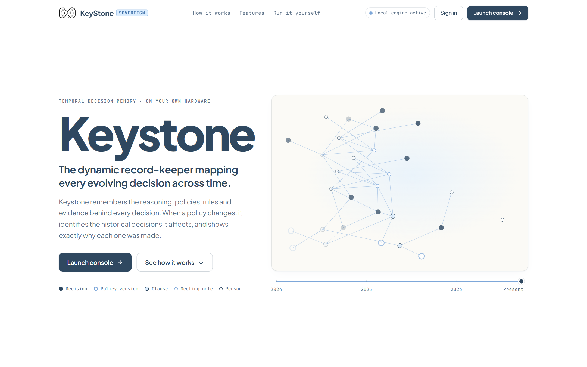

> *"A decision was correct when we made it. The rules changed. What happens now?"*

Team **minty jamun** · ASYNC'26, Track 1 (Sovereign AI) · state of the project on 1 October 2026

</div>

---

## Contents

1. [The problem](#1-the-problem)
2. [The solution](#2-the-solution)
3. [Screenshots](#3-screenshots)
4. [Features](#4-features)
5. [Architecture](#5-architecture)
6. [Tech stack](#6-tech-stack)
7. [With Keystone vs without](#7-with-keystone-vs-without)
8. [Competitor comparison](#8-competitor-comparison)
9. [Market potential](#9-market-potential)
10. [Business model](#10-business-model)
11. [Legal and privacy design](#11-legal-and-privacy-design)
12. [Results and evaluation](#12-results-and-evaluation)
13. [Run it yourself](#13-run-it-yourself)
14. [Demo script](#14-demo-script)
15. [Repository layout](#15-repository-layout)
16. [Limitations and roadmap](#16-limitations-and-roadmap)
17. [Sources](#17-sources)

> **How to read this README.** Everything described as built is in this repository. Anything not built is marked
> **Planned**. Market figures carry their source and year. The demo organisation, *Nimbus Ledger*, and all of its
> data are **synthetic**.

---

## 1. The problem

Organisations make decisions that depend on rules: a spending limit, a data-retention period, an approval
threshold. The rules change, the people who made the decisions leave, and the reasoning is scattered across
email, chat, meeting notes and PDFs. Nobody can cheaply answer the question an auditor, a regulator or a new
manager eventually asks.

**Problem statement.** Small regulated organisations (roughly 10 to 50 people, for example Indian fintech and
healthtech teams) have no persistent, time-aware record that connects each decision to the policy clause version
that governed it. When a policy changes, they cannot tell which past decisions and which ongoing practices are now
affected. They cannot afford enterprise governance software, and they cannot send sensitive internal records to a
third-party cloud AI. They need a system that, **inside their own infrastructure**:

1. remembers decisions with their date, owner and reasoning,
2. evaluates a decision against the policy version in force on its date,
3. detects the effect of every later policy change, and
4. lets an AI propose actions while only a human can approve them, with a tamper-evident record of every step.

### A real-world example

Priya joins a small fintech as operations lead. In her first week an auditor asks whether a **₹4,00,000 vendor
contract** signed fourteen months earlier followed the procurement policy.

- The signer, CTO Vikram Shah, has left the company.
- The policy has changed: when he signed, the CTO could approve up to ₹5,00,000. Since 1 July 2025 the limit is
  ₹2,00,000.
- The reasoning is in a meeting note, the approval in an email thread, and the policy versions in two PDFs.

**Without Keystone**, Priya spends days digging and still can't be sure which version applied. **With Keystone**
she asks one question and gets: *compliant under PROC-3.1 v1 (limit ₹5,00,000 on 14 March 2025); today the same
contract would need CEO sign-off under v2*, with every sentence citing the decision record and clause version.

### Pain points

| # | Pain point | Who feels it |
|---|---|---|
| P1 | Institutional memory walks out when people leave; the "why" is gone | New hires, successors, auditors |
| P2 | Policies are documents, not versioned clauses: nobody can say which rule applied on a date | Compliance and operations leads |
| P3 | A policy change silently turns past decisions or running practices non-compliant | Compliance lead, CEO |
| P4 | Audit preparation is manual archaeology across email, chat and PDFs | Ops, compliance, auditors |
| P5 | General AI chatbots invent answers, cite nothing, and ignore what was true at the time | Anyone relying on the answer |
| P6 | Sending decisions, policies and meeting audio to a cloud AI is not acceptable to regulated teams | Founders, compliance |
| P7 | Autonomous AI agents have no hard approval gate and no trustworthy record | Leadership, auditors |
| P8 | Confidential records must not reach people or models that should not see them | Compliance, executives |
| P9 | Enterprise governance suites are priced and sized for larger organisations | 10 to 50 person teams |
| P10 | "What if we cut retention to 60 days?" can only be answered by hand | Leadership |

---

## 2. The solution

Keystone is a **self-hosted application stack** that sits beside the company's own servers: one `docker compose`
deployment (API, graph database, relational database, separate executor) plus a web front end. The language models
run locally through Ollama. Nothing leaves the machine.

It implements the full private-AI pipeline: **Data → Knowledge → Memory → Reasoning → Action**.

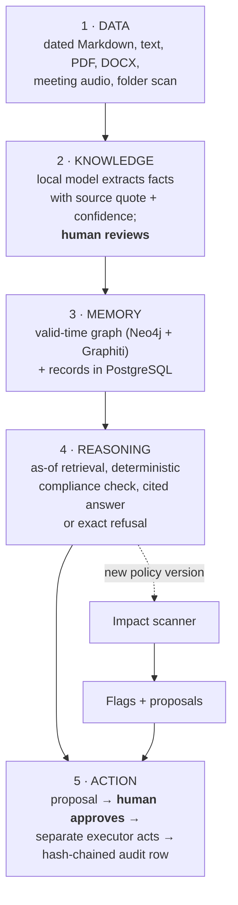

| Stage | What happens |
|---|---|
| **Data** | Documents carry their *real* date (`decided_on`, `effective_from`, `meeting_date`) in YAML front-matter, or the uploader gives the date for a plain `.md/.txt/.pdf/.docx`. Sources: browser upload, a form that writes the front-matter, a polling drop folder, a sign-in scan of a company folder tree, and meeting audio transcribed locally. The date never comes from the upload time or the model. |
| **Knowledge** | The local model proposes facts (people, decisions, projects, `MADE_BY`, `ABOUT`, `SUPERSEDES`), each with its source sentence, character span, model-reported confidence and review state. **Nothing counts until a human accepts it.** Policy clauses are structured: `RET-2.1@v2` with machine-checkable fields such as `retention_days_max: 180`. |
| **Memory** | A temporal graph in Neo4j via Graphiti (every edge has valid time and ingestion time) plus PostgreSQL for records and accountability data. Uploading a new policy version closes the previous one automatically. |
| **Reasoning** | Access filter → hybrid retrieval (BM25 + cosine, reciprocal-rank fusion) as of a date → relevance gate → **deterministic compliance check** → generation where every sentence must cite a source. Nothing relevant? The answer is exactly *"I have no recorded decision about that."* |
| **Action** | The model, the scanner and MCP clients can only create a `proposed` row. A person approves in the Inbox (separation of duties, domain authority and rupee limits enforced on the server). A **separate executor process** acts and appends an audit row with the output's SHA-256. |

### How each pain point is addressed

| Pain point | Keystone |
|---|---|
| P1 Memory walks out | Owners, dates and reasons live in the graph; a departed owner is still named and cited |
| P2 Unversioned policies | Clause-level versions with validity windows; any question can be asked *as of* a date |
| P3 Silent breaches | The impact scanner runs on every new policy version and routes a proposal to the responsible person |
| P4 Audit archaeology | Cited answers, per-decision pages, evidence export, compliance and audit-prep reports (Markdown/PDF) |
| P5 Hallucination | Forced citations, citation validation, relevance gate, fixed refusal; verdicts computed by code |
| P6 Cloud is off-limits | Models, embeddings, speech-to-text, databases and executor all local; telemetry off; fonts bundled |
| P7 Unsafe agents | Only a human sets `approved`; executor is a separate process; DB-enforced append-only audit log |
| P8 Confidentiality | `org`/`team`/`restricted` labels, role tiers and per-user grants enforced on the server, before the prompt |
| P9 Enterprise pricing | One compose stack, open-weight models, open-source infrastructure |
| P10 Hypotheticals | `/whatif` simulates a policy change or a person leaving, clearly labelled "HYPOTHETICAL" |

### Our USP

**Point-in-time, clause-level compliance memory with a structural approval gate, self-hosted for small teams.**

1. A **deterministic** check against the clause version valid on the decision date. The model cannot invent a verdict.
2. A **scanner** that re-runs that check whenever a policy changes and tells the right person what is now affected.
3. A **hard approval gate and audit chain**: AI can propose, never act alone.

> **In action.** A compliance lead uploads retention policy v3 (180 → 90 days, effective 28 Sep 2026). In about
> 13 seconds the scanner flags DEC-007 (*reduce log retention to 180 days*, compliant in June 2025) as an
> **ongoing practice breach**, marks DEC-002 as superseded, and queues a proposal for the responsible person. A
> human approves; the executor writes the notification; the audit chain verifies. Drag the timeline back to 2024
> and the graph shows v1 (365 days) in force and DEC-007 not yet existing.

---

## 3. Screenshots

### Landing page

| Hero: the temporal graph builds itself | Scroll story: from a decision to its evidence |
|---|---|
|  | 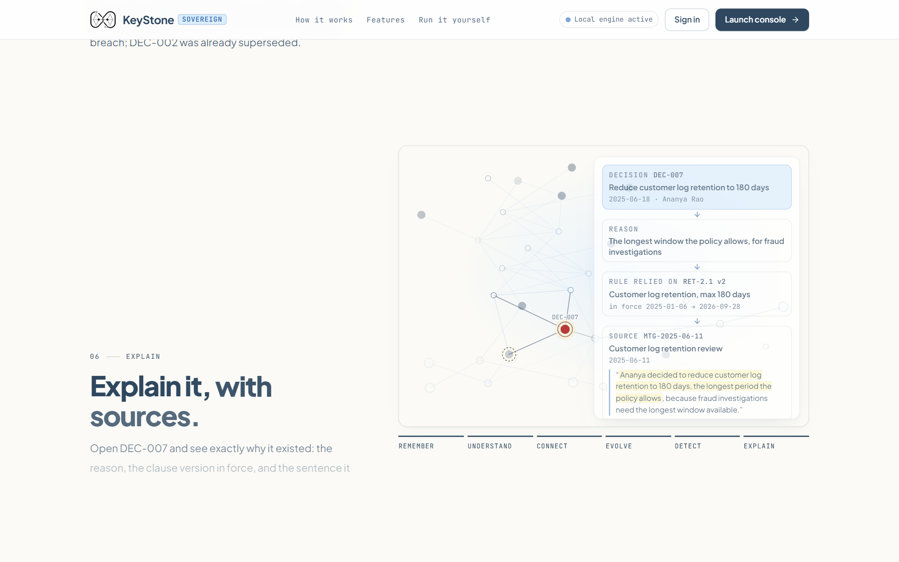 |

### Inside the app

**Ask with an "as of" date: compliant then, non-compliant now, every sentence cited**
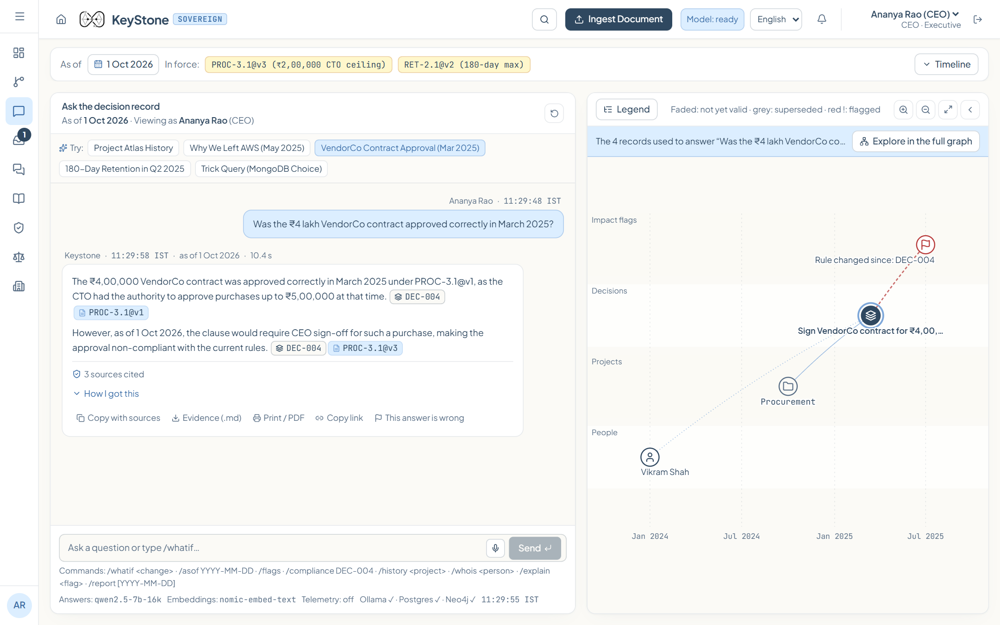

**Temporal graph: one lane per entity type, x = date, policy milestones on the timeline, inspector on the right**
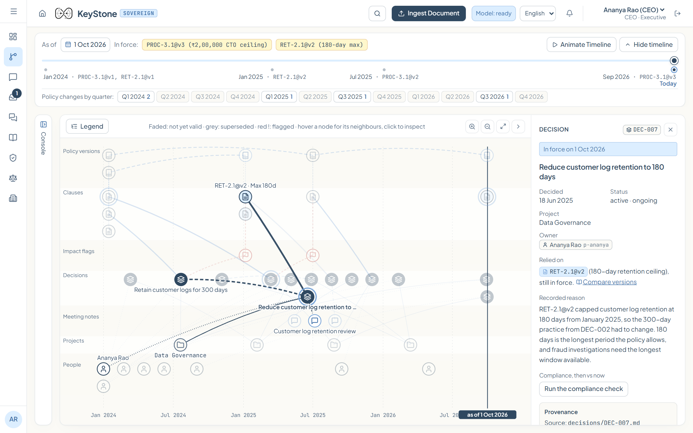

| Role-scoped dashboard | Inbox: a staleness flag with its decision context |
|---|---|
| 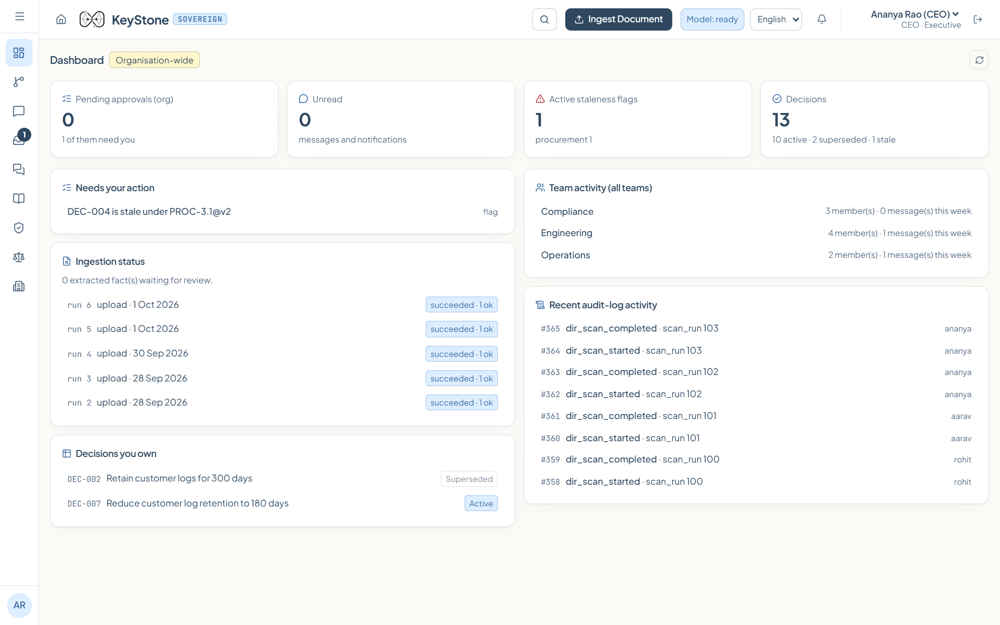 | 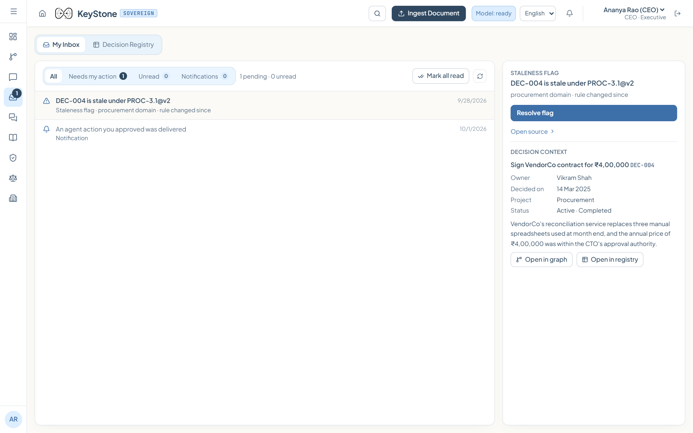 |

| Decision registry (as of any date) | Policy versions compared clause by clause |
|---|---|
| 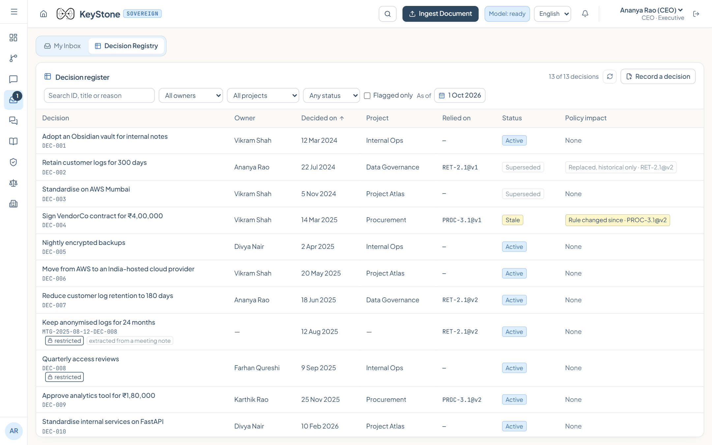 | 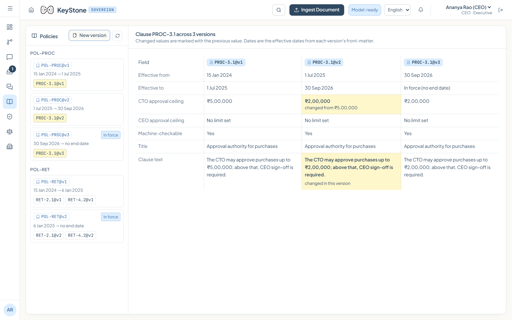 |

| Hash-chained audit log, verified on the server and in the browser | Jurisdiction: a member clicks a decision outside their department |
|---|---|
| 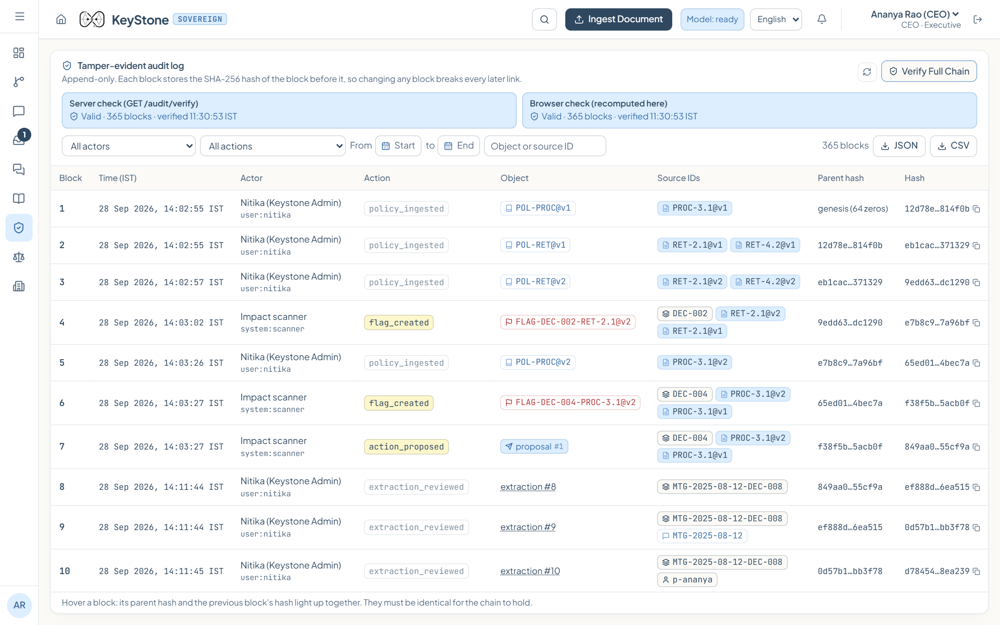 | 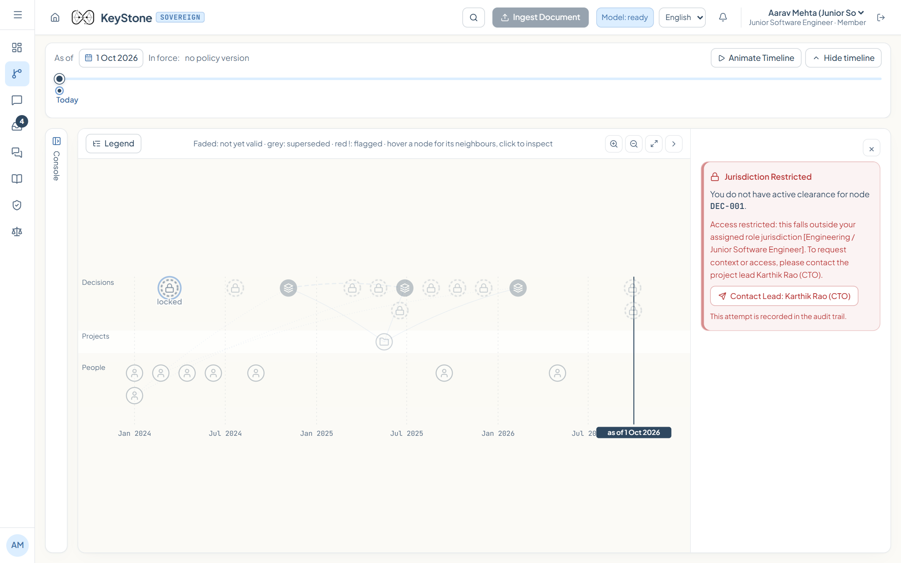 |

| Admin: roles, teams, designations | Sign in (demo accounts one click away) |
|---|---|
| 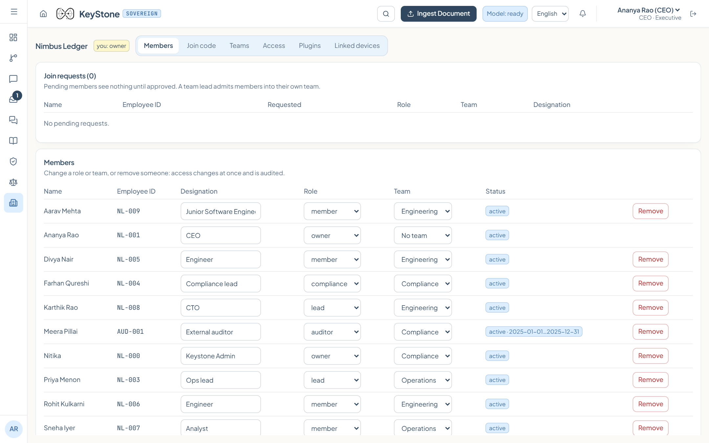 | 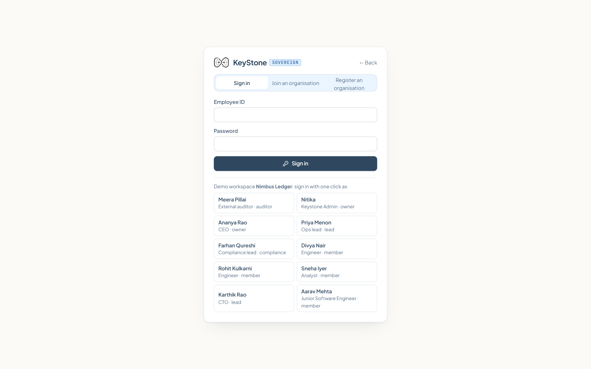 |

---

## 4. Features

### Baseline (MVP), all built

| Feature | What it does |
|---|---|
| **Front-matter ingestion with real valid time** | `decision`, `policy_version` and `meeting_note` documents must carry a real date; ingestion is chronological; re-uploading an ID replaces it after a warning |
| **Plain document upload** | `.md/.txt/.pdf/.docx` without front-matter is stored as a dated plain document; unreadable files (other types, scanned PDFs without text, corrupt or non-UTF-8 files) are refused with the reason |
| **Extraction with provenance + human review** | JSON-schema-constrained output at temperature 0; each fact keeps quote, span, confidence, extractor and review state; accept, edit or reject, singly or in bulk |
| **Clause-level policy versioning** | Clause IDs, versions, validity windows, structured fields; open-textured clauses are `checkable: false` |
| **Deterministic compliance** | `compliant`, `non_compliant`, `not_checkable` or `no_clause`, for the decision date and for today |
| **Policy-impact scanner** | `ONGOING_PRACTICE_BREACH` (proposal, action needed), `RULE_CHANGED_SINCE` (proposal, informational), `SUPERSEDED` (historical) |
| **Cited answers or refusal** | Source chips, as-of date, timing, "How I got this" panel; copy with sources, evidence file (`.md`), print to PDF, deep link |
| **Temporal graph + timeline** | Date-proportional graph with a draggable as-of slider and policy milestones; after an answer, shows only the records it used |
| **Inbox and Decision Registry** | Approvals inline with decision context, flags, facts to review, proposed decisions, corrections, notifications; registry with active / superseded / stale |
| **Human-gated action** | Separation of duties, domain authority, rupee limits read from the clause in force; a separate executor writes an RFC 5322 `.eml` |
| **Hash-chained audit log** | DB trigger computes SHA-256 links; app role is INSERT/SELECT only; a second trigger blocks updates and deletes; verified on the server and in the browser |
| **Local-first** | Ollama models, local embeddings, local Whisper; telemetry off; `/health` reports engine status |

### Advanced features, all built unless marked

| Feature | What it does |
|---|---|
| **Identity and organisations** | Register an org or join with a code; owner approves members; Argon2 hashes; signed JWT cookie; join-code rotation |
| **Roles and jurisdiction** | Executive / lead / member tiers plus a time-limited read-only auditor; `org`/`team`/`restricted` labels; per-user grants; members see only their department's projects; per-person approval ceilings in ₹ |
| **Workspace shell** | Sidebar filtered to the role; dashboards scoped on the server (organisation, domain or personal) |
| **Team chat with governed access** | Org channels, team channels, DMs; unread and mention counts; chat is never indexed, but a thread can be promoted to a decision note |
| **MCP servers** | `keystone` (ask, check_compliance, list_policies, list_flags, list_proposals, verify_audit_chain, propose_action) and `keystone-comms` (gated pings, DMs, channel posts). An agent session cannot approve |
| **Policy proposals and collisions** | Claims with expiry, review locks, three-layer duplicate detection; collisions routed to an authority who is never a party |
| **`/whatif` simulator** | Simulates a threshold change or a person leaving on an in-memory overlay; nothing is written except a simulation row |
| **Slash commands** | `/asof`, `/flags`, `/compliance`, `/history`, `/whois`, `/explain`, `/report`, `/whatif` |
| **Reports** | Compliance as of a date and an audit-prep pack, Markdown or PDF |
| **Meeting audio** | Recorded consent, local transcription with timestamps, speaker mapping, cited quotes replay from their timestamp; a voice mic in chat (the browser's cloud speech API is deliberately not used) |
| **Hindi UI** | react-i18next; answers translated sentence by sentence locally; citation IDs never enter the translation prompt |
| **Model warm-up** | Sign-in warms the models; heartbeat keeps them loaded; idle unloads after 15 minutes |
| **Sign-in folder scan** | `Organisation/`, `Team/<name>/`, `Groups/<name>/` diffed by SHA-256; the folder sets the access label; nothing ingested automatically |
| **Rule packs** | YAML rule packs plug into the checker; two illustrative, synthetic packs (DPDP-style retention, RBI-style vendor sign-off). Not legal advice |
| **Phone pairing** | Pair a phone by QR code and approve on the go; devices listed and revocable |
| **Authoring forms** | "Record a decision" and "Add a policy version" write the front-matter and know which clause versions were in force |

---

## 5. Architecture

### Deployment: everything inside the company network

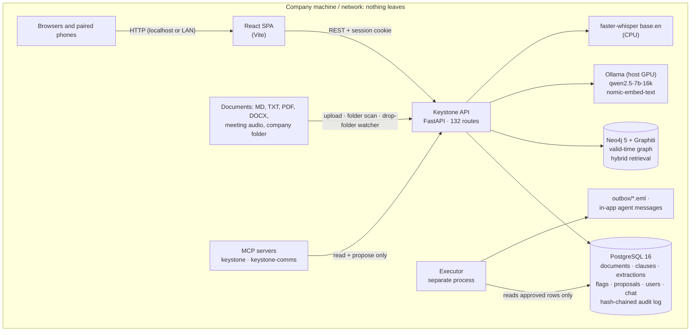

### A question, end to end

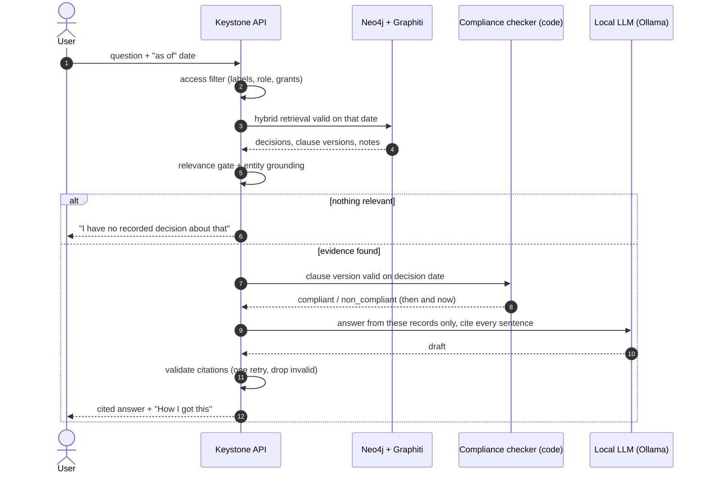

### A policy change, end to end

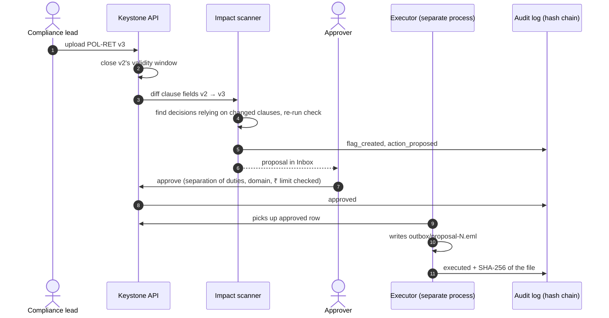

### Design principles

- **Model as narrator, code as judge.** The verdict is deterministic; the LLM only words it and cannot change a result, number or ID.
- **Structural, not cosmetic, approval.** The executor is a separate process; the audit log is enforced by the database itself.
- **Refusal is a feature.** A calibrated relevance threshold plus entity grounding returns an exact refusal sentence.
- **Access before the prompt.** Restricted records never reach the model for an unauthorised asker.
- **Runs on a laptop GPU.** One 7B-class model serves both answering and extraction.

---

## 6. Tech stack

| Layer | Technology | Purpose |
|---|---|---|
| **Frontend** | React 19, Vite 8, Tailwind CSS 4, lucide-react | Single-page app, "Ice & Butter" design tokens, bundled fonts (Plus Jakarta Sans, JetBrains Mono), no CDN calls |
| **Landing motion** | GSAP + ScrollTrigger, Lenis, d3-force | Animated temporal graph and scroll story |
| **i18n / pairing** | i18next, react-i18next · qrcode.react, html5-qrcode | Hindi UI · phone pairing by QR |
| **Backend** | FastAPI 0.141, Uvicorn, Python 3.12, asyncpg | REST API (132 routes), background tasks, folder watcher |
| **Answer + extraction LLM** | **qwen2.5:7b** (open weights) via Ollama as `qwen2.5-7b-16k` (16,384-token context, temperature 0, JSON-schema output) | Cited answers, fact extraction, explanation wording, what-if parsing, translation |
| **Embeddings** | **nomic-embed-text** (768-d) via Ollama | Semantic retrieval, duplicate detection |
| **Speech-to-text** | **faster-whisper `base.en`** on CPU, weights bundled | Meeting audio, voice questions |
| **Temporal graph** | **Graphiti** 0.30.2 (by Zep) on **Neo4j 5.26** Community | Valid-time graph; BM25 + cosine with reciprocal-rank fusion |
| **Relational store** | **PostgreSQL 16** | Documents, clauses, extractions, flags, proposals, answers, users, teams, chat, audit log |
| **Audit integrity** | PL/pgSQL triggers, SHA-256 (pgcrypto), restricted DB roles | Hash chain, append-only enforcement |
| **Identity** | argon2-cffi, PyJWT, join codes | Login, member approval, device sessions |
| **Documents** | pypdf, python-docx, PyYAML · fpdf2 | Local text extraction · PDF reports |
| **Agent protocol** | MCP over stdio (stdlib-only Python) | External agents read and propose, never approve |
| **Agents** | No autonomous framework (no LangChain / Mem0 / Letta). Fixed components: extractor, reasoning engine, impact scanner, executor | Keeps behaviour auditable |
| **Deployment** | Docker Compose (`postgres`, `neo4j`, `backend`, `executor`), ports bound to 127.0.0.1, Ollama on the host | Single-machine, on-premises |
| **Testing** | pytest (isolated backend on :8001, separate DB and graph group), Node test runner, oxlint, answer-key evaluation | Quality checks that never touch demo data |

Developed and demoed on a Windows 11 laptop with an 8 GB NVIDIA GPU (RTX 4070; RTX 4060 also tested).

---

## 7. With Keystone vs without

| Moment | Without Keystone | With Keystone |
|---|---|---|
| A policy changed yesterday | Nobody knows which decisions or running practices it affects | The scanner flagged them; proposals wait in the right person's Inbox |
| Auditor asks about a 14-month-old contract | Hunt through email and PDFs; the signer left; guess the version | One cited question: the version then and now |
| New hire asks "why did we leave AWS?" | Ask around; the owner has left | Cited answer with owner, date, reasons and the meeting note |
| Weekly review | A spreadsheet nobody updates | Decision Registry: active / superseded / stale, as of any date |
| A sensitive decision must stay restricted | Folder permissions and hope | Server-enforced labels; the model never sees it for unauthorised askers |
| Someone wants AI to email a partner | Forbidden, or done without oversight | Agent proposes, an authorised human approves, executor sends, audit row |
| Quarter-end audit prep | Days of manual assembly | Generated compliance and audit-prep report (Markdown/PDF) |

### Against the alternatives

| Approach | Where it falls short | Why Keystone fits this job |
|---|---|---|
| **Manual auditing** | Slow, depends on who is still around, no ongoing monitoring | Instant cited answers, continuous scanning, evidence export |
| **Basic logging** | Says *what* happened, not *which rule applied* or *why* | Links each decision to its clause version, reasons and owner; verifiable hash chain |
| **RAG chatbot over a drive** | Knows the latest text only; can hallucinate; no flags; no approval gate; often cloud-hosted | As-of retrieval, deterministic verdicts, forced citations, exact refusal, scanner, approval gate, local only |
| **Enterprise compliance suites** | Priced for larger organisations; vendor cloud; built for framework certification | Self-hosted, small-team sizing, focused on decision-to-clause memory |

Keystone does **not** replace certification suites (for example continuous SOC 2 control monitoring). It answers
a different, narrower question and can sit alongside them.

---

## 8. Competitor comparison

Characterisations are our reading of each vendor's public positioning, not a hands-on test.

| | Hosting | Policy version as of a date | Decision ↔ clause link | Flags past decisions on policy change | Approval gate + tamper-evident audit | Fit for 10–50 people |
|---|---|---|---|---|---|---|
| **Keystone** | Self-hosted, local models | ✅ | ✅ | ✅ | ✅ | ✅ design target |
| Drive / SharePoint + RAG chatbot | Usually cloud | ❌ latest text | ❌ | ❌ | ❌ | ✅ but no temporal model |
| ADRs, Notion, Confluence | Cloud or self-hosted | Manual | Manual | ❌ | ❌ | ✅ nothing automatic |
| Vanta, Drata | Vendor cloud | Not their purpose | Not their purpose | Not their purpose | Workflow approvals | Partly (entry pricing exists) |
| Obin AI | Enterprise deployments | Indicates auditability | Not public | Not public | Indicates auditability | ❌ targets large institutions |
| Zep / Graphiti | Library or hosted | ✅ bi-temporal facts | ❌ building block | ❌ | ❌ | Needs an app on top |
| Workspace AI search (Microsoft, Google) | Vendor cloud | ❌ | ❌ | ❌ | Tenant-level controls | ✅ for search only |

**Where we win:** "compliant then, non-compliant now" as a computed, cited answer · automatic impact flags ·
AI cannot act without human approval, enforced by the architecture · nothing leaves the machine · small-team
sizing.
**Where we don't (yet):** breadth of integrations, certifications, scale, multi-tenant hosting, proven production
use.

---

## 9. Market potential

Figures from web searches on 1 October 2026, read from publishers' summaries and press releases (full reports not
purchased). Firms define markets differently, so we show ranges, not a single truth, and **these are not revenue
forecasts for Keystone**.

### Adjacent markets

| Market | Reported size | Source |
|---|---|---|
| **RegTech** | $24.34B (2025) → **$112.10B (2033)**, CAGR 21.1% | Grand View Research |
| RegTech (second estimate, lower confidence) | $18.84B (2025) → $38.44B (2030), CAGR ~15% | Research and Markets listing |
| **Decision intelligence** | **$16.3B–$19.4B (2025)**, CAGR 13.9%–29.8% by firm | IMARC, Grand View, Precedence, Fortune Business Insights |
| **Graph database** | $0.65B (2025) → **$2.14B (2030)**, CAGR 27.1% | MarketsandMarkets |
| Graph database (spread) | $2.58B–$8.89B depending on firm and horizon | Technavio, Expert Market Research, IndustryARC, Mark & Tel |

Keystone's serviceable segment, small regulated teams needing decision-level compliance memory, is a thin slice of
these. **We have not sized that slice.**

### Why now

| Signal | Detail |
|---|---|
| **DPDP Rules, 2025** | Notified 14 Nov 2025; comprehensive obligations for data fiduciaries mandatory within 18 months (~May 2027); penalties up to **₹250 crore** for failing to maintain security safeguards |
| **Target base in India** | **1,97,692** DPIIT-recognised startups (31 Oct 2025); **3,085** recognised fintech startups (30 Apr 2023, likely understated today) |
| **Data localisation** | RBI's 6 April 2018 circular: payment-system data stored only in India |
| **Context-graph thesis** | Foundation Capital, *"AI's trillion-dollar opportunity: context graphs"* (Dec 2025): the next platforms own *why* decisions happened |
| **Analyst view** | Gartner reportedly predicts **>50%** of AI-agent systems will use context graphs by 2028 (secondary coverage; report not read) |
| **Open-source momentum** | Graphiti: 20,000+ GitHub stars; Zep temporal-KG paper (Jan 2025) |
| **Funding** | Obin AI out of stealth (18 Mar 2026) with a **$7M seed** for governed agents in finance |

### Price anchors: what small teams already pay

| Vendor | Observed pricing |
|---|---|
| Vanta | ~$10,000/yr entry, $80,000+ at scale; 1–50 employees typically $12,000–$28,000/yr (third-party estimates) |
| Drata | $7,500–$15,000/yr for startups, $30,000–$100,000+ at scale; median $25,000 over 233 purchases (Vendr) |

These address SOC 2 / ISO certification rather than decision-level compliance memory, so they anchor willingness to
pay, not a like-for-like price. **Demand is inferred from regulation and market signals; no customer interviews have
been run yet.** That is the main open risk.

---

## 10. Business model

Status: **Planned / hypothesis**, not tested with customers.

| Tier | For | Includes | Indicative price |
|---|---|---|---|
| **Community** | Students, tiny teams, evaluators | Open-source core, self-install, community support | Free |
| **Team** | 10–50 person regulated startups | Supported installer, updates, rule packs, reports, email support | Annual licence per org, below certification-suite entry prices (low thousands of USD/yr) |
| **Business** | 50–250 people | + SSO, backup/HA guidance, connectors (Planned), priority support | Annual licence + per-connector fees |
| **Enterprise / Partner** | Consultancies, multi-entity orgs | Multi-tenant isolation, white-label, custom rule packs, deployment services | Custom |

Other routes: implementation and onboarding services · maintained, lawyer-reviewed rule-pack subscriptions
(**Planned**) · hardware-bundled appliance for teams without a GPU (**Planned**) · channel partners (auditors and
compliance consultancies).

### Expansion

Healthtech and clinics · small banks, NBFCs and insurers · legal and accounting firms · public-sector offices ·
manufacturing and pharma quality systems (versioned SOPs) · auditors running it per client · global SMBs under
GDPR-style rules.

---

## 11. Legal and privacy design

Every component (models, embeddings, speech-to-text, graph, database, executor, front-end assets) runs on the
customer's own infrastructure. The application makes no request to an external service and telemetry is disabled.
In a recorded browser run through every screen plus a question, every request went to localhost and no container
held an established connection to a public address.

| Area | Why the on-premises design helps |
|---|---|
| **DPDP Act 2023 + Rules 2025** | No new processor or third-party recipient: no DPA with a cloud AI vendor, no cross-border questions. The customer stays the data fiduciary |
| **Data residency** | Data stays wherever the customer runs it, so sectoral rules like RBI's payment-data localisation are not at the mercy of a vendor region |
| **Confidentiality** | Decisions, policies and audio never reach a model provider that could retain or train on them |
| **Accountability** | Hash-chained log and approval record support the customer's obligations (tamper-*evident*, not certified) |
| **Voice data** | Local transcription; recording consent required at upload; the browser's cloud speech API avoided |

This is a design analysis, **not legal advice**. We do not claim Keystone makes anyone DPDP-compliant, that the
audit log is regulatory-grade, or that the bundled rule packs reflect law.

---

## 12. Results and evaluation

| Check | Result | When |
|---|---|---|
| **Backend test suite** | **139 of 139 passed** (ingestion, as-of graph, ask, audit chain, visibility, roles, identity, comms, devices, plugins, jurisdiction, conflicts, what-if, reports, audio, i18n, session, views, workspace, plain upload) | 1 Oct 2026 |
| Frontend | 17 unit tests pass; lint; production build | 1 Oct 2026 |
| Scripted demo answers vs answer key | 5 of 5 correct, every sentence cited | 28 Sep 2026 |
| Extraction vs answer key | Precision 1.00, recall 0.67 (the miss is a duplicate skipped on purpose) | 28 Sep 2026 |
| Refusal on an unrecorded topic | Exact refusal returned ("Why did we choose MongoDB?") | 28 Sep 2026 |
| Retrieval calibration | On-topic ≥ 0.836, off-topic ≤ 0.763 against a 0.80 cut-off | Sep 2026 |
| Scanner on live policy upload | Affected decisions flagged in ~13 s (team-measured) | Demo laptop |
| Answer latency | ~10 s per answer; Hindi adds ~20–35 s; cold model load ~7 s (team-measured) | Demo laptop |
| Audit chain | Valid on the server and in the browser | 1 Oct 2026 |
| Local-only operation | Every browser request to localhost; no public connections from containers | 30 Sep 2026 |

**Confidence:** high for the scripted synthetic scenario, **low-to-unknown for real-world data** until piloted.
Five questions and one synthetic organisation are too small for general accuracy claims.

---

## 13. Run it yourself

**Prerequisites:** Docker Desktop, [Ollama](https://ollama.com) running on the host, Node 20+.

**Windows, one command** (models, stack, demo data, Whisper weights, frontend packages):

```powershell
powershell -ExecutionPolicy Bypass -File scripts/setup-demo.ps1
npm run dev
```

**Manual steps (any OS):**

```bash
sh scripts/create_models.sh            # once per machine: qwen2.5-7b-16k (16k context) + nomic-embed-text
cp .env.example .env
docker compose up -d --build --wait    # Postgres :5432, Neo4j :7474/:7687, API :8000 (/docs), executor
docker compose exec backend python -m app.seed   # the Nimbus Ledger demo data (~1 min on a 4070 laptop)
npm install && npm run dev             # http://localhost:5173
```

Or restore the committed snapshot instead of seeding (Windows):

```powershell
powershell -File scripts/restore.ps1 -Name nimbus-seed
```

Open <http://localhost:5173>, click **Sign in** and pick one of the demo accounts (CEO, CTO, compliance lead, ops
lead, engineers, analyst, admin, external auditor). Demo seeding and one-click demo sign-in are switches in `.env`
(`DEMO_SEED`, `DEMO_LOGIN`): **turn them off for any real deployment.**

**MCP (for example Claude Desktop):**

```json
{ "mcpServers": { "keystone": { "command": "python", "args": ["<repo>/mcp/keystone_mcp.py"] } } }
```

**Tests:**

```bash
docker compose exec backend python -m pytest -q tests     # isolated backend on :8001, never touches demo data
node --test "src/**/*.test.js"                            # frontend unit tests
python backend/tests/eval.py http://localhost:8000        # answer-key evaluation (writes answers: restore after)
```

---

## 14. Demo script

1. **Ask** *"Show the history of Project Atlas."* → DEC-003 → DEC-006 → DEC-010, in order, with owners.
2. **Ask** *"Why did we move off AWS in May 2025?"* → Vikram Shah, 2025-05-20, data residency and cost, cites the meeting note.
3. **Ask** *"Was the ₹4 lakh VendorCo contract approved correctly in March 2025?"* → yes under PROC-3.1 v1; today it would need CEO sign-off.
4. **Ask** *"Was keeping customer logs for 180 days compliant in Q2 2025?"* → yes, RET-2.1 v2. Drag the timeline to 2024: the graph shows v1.
5. **Ingest** `data/demo-upload/POL-RET-v3.md` → DEC-007 flagged `ONGOING_PRACTICE_BREACH`.
6. **Approve** the proposal in the Inbox → the executor writes `outbox/proposal-N.eml`.
7. **Audit Log** → *Verify Full Chain*.
8. **Ask** *"Why did we choose MongoDB?"* → refused.

Expected answers live in `data/ground-truth.json`. Recording guide: [docs/DEMO-RECORDING.md](docs/DEMO-RECORDING.md).

---

## 15. Repository layout

```
keystone-async/
├── backend/
│   ├── app/              FastAPI app: ingest, extract, graph, ask, compliance, scanner, executor,
│   │                     identity, permissions, views, whatif, reports, stt, routers_p1/, routers_p2/
│   ├── sql/              schema, roles, audit-chain triggers
│   └── tests/            pytest suite (isolated backend), eval.py, calibrate_threshold.py
├── mcp/                  keystone_mcp.py, keystone_comms.py (stdio, stdlib only)
├── src/
│   ├── home/             landing page: hero, temporal graph, scroll story
│   ├── components/       Dashboard, Ask, Graph, Inbox, Policies, Audit Log, Ingest…
│   └── features/         p1/ (auth, chat, admin, jurisdiction, devices) · p2/ (proposals, scan, reports, audio)
├── data/
│   ├── vault/            synthetic Nimbus Ledger decisions, policies, meeting notes, people
│   ├── demo-upload/      live-demo policy v3 and audio
│   └── ground-truth.json answer key (never ingested)
├── backups/nimbus-seed/  Postgres + Neo4j snapshot of the demo state
├── ollama/               Modelfile for the 16k-context model
├── scripts/              setup-demo, restore, snapshot, create_models, diagnose
└── docs/                 REFERENCE.md (as-built reference), demo guides, screenshots
```

---

## 16. Limitations and roadmap

**Known limitations**

- The dataset is synthetic; extraction quality (7B model) bounds the graph, so every extracted fact needs review.
- Open-textured clauses return `not_checkable` by design.
- The audit log is tamper-evident, not regulatory-grade.
- Single-tenant, single-node; integrations are `.eml` files, in-app messages and MCP.
- Speech-to-text can mishear names; Hindi translation is slow on a laptop GPU.
- Server-side visibility filters exist on every read endpoint but deserve a dedicated end-to-end test before a real deployment.

| Horizon | Items |
|---|---|
| **Done** | Five-stage pipeline, temporal graph, deterministic compliance, scanner, approval gate + executor, hash-chained audit, roles and jurisdiction, workspace, chat, MCP, audio, Hindi, what-if, reports, plain document upload |
| **Weeks** | Offline rehearsal with the network physically disabled; end-to-end visibility tests on every read endpoint; store audit payloads next to their hashes |
| **Months** | Pilot with 2–3 real regulated teams; connectors (email, Jira, Slack, Drive/SharePoint/Notion); executor via MCP tools; better extraction with measured precision/recall on real notes; lawyer-reviewed rule packs |
| **Long term** | Multi-tenant hosting (graph per tenant); HA deployment; pseudonymisation and erasure workflow; exceptions and waivers; more Indian languages; external anchoring of the audit-chain head |

> **Credit where due.** Temporal graphs, RAG, knowledge graphs, MCP and human-in-the-loop approval are not ours.
> Graphiti (by Zep) is the graph engine underneath; Keystone adds the clause model, the deterministic compliance
> check, the impact scanner, the approval gate and the product around them.

---

## 17. Sources

<details>
<summary>External sources for the market and regulatory figures</summary>

- Foundation Capital, "AI's trillion-dollar opportunity: context graphs" (Dec 2025): https://foundationcapital.com/ideas/perspective/ · coverage: [Finextra](https://www.finextra.com/blogposting/31629/context-graphs-ais-trillion-dollar-opportunity-solved-years-back-in-capmarkets), [Forbes](https://www.forbes.com/sites/josipamajic/2026/04/03/vcs-say-context-graphs-might-be-the-next-big-thing-in-ai/)
- Gartner context-graph prediction as summarised by Atlan (2026): https://atlan.com/know/gartner-context-graphs/
- Graph database: [MarketsandMarkets](https://www.marketsandmarkets.com/PressReleases/graph-database.asp) · [Technavio](https://www.technavio.com/report/graph-database-market-analysis) · [Expert Market Research](https://www.expertmarketresearch.com/reports/graph-database-market) · [IndustryARC](https://www.industryarc.com/research/graph-database-market-research-500973)
- RegTech: [Grand View Research](https://www.grandviewresearch.com/press-release/global-regulatory-technology-market) · [Research and Markets](https://www.researchandmarkets.com/reports/5939382/regtech-market-report)
- Decision intelligence: [IMARC](https://www.imarcgroup.com/decision-intelligence-market) · [Grand View Research](https://www.grandviewresearch.com/industry-analysis/decision-intelligence-market-report) · [Precedence Research](https://www.precedenceresearch.com/decision-intelligence-market) · [Fortune Business Insights](https://www.fortunebusinessinsights.com/decision-intelligence-market-108592)
- DPDP Rules, 2025: [PIB](https://www.pib.gov.in/PressReleasePage.aspx?PRID=2190655&reg=48&lang=2) · [Grant Thornton India](https://www.grantthornton.in/globalassets/1.-member-firms/india/assets/pdfs/flyers/dpdpa-rules-detailed-brochure_final-25th-november-2025-1.pdf)
- Cross-border transfers and RBI localisation: [Legal 500](https://www.legal500.com/intelligence/india/privacy/cross-border-data-transfers-under-indias-dpdp-act-rules-restrictions-and-compliance-roadmap-for-2027) · [Treelife](https://treelife.in/compliance/data-localisation-in-india/)
- Startup India / DPIIT: [PIB](https://www.pib.gov.in/PressReleasePage.aspx?PRID=2197662&reg=3&lang=1) · fintech count: [Inc42](https://inc42.com/buzz/india-home-to-3085-dpiit-recognised-fintech-startups-govt/)
- Obin AI: [Business Wire](https://www.businesswire.com/news/home/20260318899337/en/Obin-AI-Emerges-from-Stealth-to-Build-Agentic-Workforce-for-Financial-Institutions)
- Zep / Graphiti: [GitHub](https://github.com/getzep/graphiti) · [paper summary](https://graphrag.com/appendices/research/2501.13956/)
- Vanta / Drata pricing: [CostBench](https://costbench.com/software/compliance-management/vanta/) · [Vendr](https://www.vendr.com/marketplace/vanta) · [Sprinto](https://sprinto.com/blog/drata-pricing/)

</details>

---

<div align="center">

**Keystone** · built by team *minty jamun* for ASYNC'26 · all demo data is synthetic

</div>
